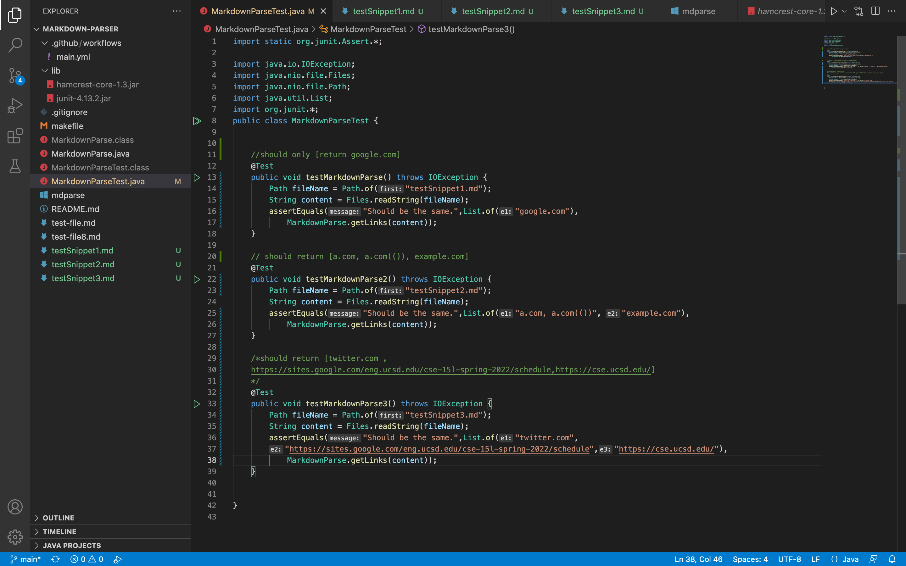

[Link](https://github.com/mikayladalton2/markdown-parser)  to my mark-down repository

[Link](https://github.com/ezh247467/markdown-parser.git)  to mark-down repository we reviewed

## Tests for 3 Snippets (including their expected output):

--------------------

# 1st snippet (my test results):

This test failed. However, I do not believe that this would be a difficult problem to fix. I would simply have to add a condition that ignores any parenthesis and brackets that occur within two backticks. 

# 1st snippet (their test results):

This test failed. However, I also do not think this would be too difficult to fix. This program would also have to add an if statement that ignores all parenthesis and brackets within backticks. 

--------------------

# 2nd snippet (my test results):

This test failed. This test may be a little more involved to fix because right now the stopping point for the link is the index of the first closed parenthesis, however we would need to change this stopping condition. It would have to match up every parenthesis to ensure it stops at the correct closed parenthesis.  

# 2nd snippet (their test results):

This test failed. Again, this fix would also be more involved as it has the same stopping condition for reading the link. The code would have to included a tracking variable that kept track of opening and closing parenthesis. 

--------------------

# 3rd snippet (my test results):

This test failed. This shouldn't be too bad of a fix. Similiar to the issue above, we would need to track brackets while searching for closed parenthesis. If an open and closed bracket occurred, it would no longer count the former as link. 

# 3rd snippet (their test results):

This test failed. This code requires the same fix as well. As you are searching for the index of closed parenthesis, if it didn't occur by the time a bracket starts, you should no longer regard the text as a link. Instead, start looking for the next link. 
