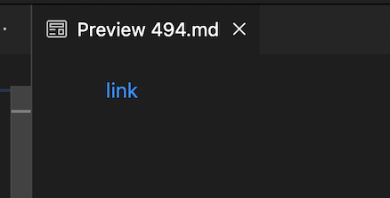

# Lab Report 5

To find these tests, I manually searched through the file
and looked for tests that corresponded to different bugs in my `MarkdownParse` repository. 
These are the links to the two test files I chose:

[Test 1](https://github.com/nidhidhamnani/markdown-parser/blob/main/test-files/490.html.test)

[Test 2](https://github.com/nidhidhamnani/markdown-parser/blob/main/test-files/494.html.test)

## **Test 1 Results:**

My implementation of MarkdownParse produced the incorrect output whereas the one provided for lab 9 produced the correct output. 

Expected output:

Nothing should be returned because no link is highlighted for MarkdownParse Preview.

Actual outputs:

testFile490, the test on my implementation, failed. Whereas testFile490T, the test file on lab 9's implementation, passed. 

The problem with my implementation is that it doesn't even check for the `<` and `>` symbols. I have highlighted where in my code it should check for these symbols below:

If the url (text inbetween open and closed parenthesis) contains these symbols, the content should not be added to the list of links. 

## **Test 2 Results:**

Both my implementation of MarkdownParse as well as lab 9's implementation of MarkdownParse produced incorrect outputs.

Expected output:

Foo should be returned because MarkdownParse preview results in a link with the url foo. 

Actual outputs:

Both testFile494, the test on my implementation, testFile490T, the test file on lab 9's implementation, failed.

Since both tests failed, I will go over lab 9's implementation for a fix. Honestly, I think a fix would be very involved. Our code does not inlcude this way of searching for a link. I have highlighted the part of lab 9's code that would need to be changed below:

Basically, I think you would need to include an entire other while loop that goes through the file and checks for a link implemented in this way. It is possible to include it in the same while loop, however I believe this may make the code very messy/confusing and hard to keep track of which type of link implmentation it is searching for. 